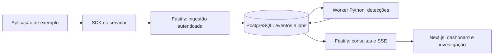

# Sentinel

Central de monitoramento de segurança para aplicações web, construída como projeto de portfólio de Fullstack, AppSec e Blue Team.

O Sentinel recebe eventos de uma aplicação integrada, identifica padrões suspeitos e permite investigar alertas com evidências. A demonstração usará uma aplicação própria e dados fictícios para mostrar o fluxo completo: atividade → evento → detecção → investigação → resposta.

**Status:** planejamento inicial, em 8 de outubro de 2026. A aplicação ainda não foi implementada. As funcionalidades abaixo são o escopo proposto.

## Primeira versão

- Organizações, projetos e chaves de ingestão restritas a cada projeto.
- SDK TypeScript para registrar eventos no servidor da aplicação monitorada.
- Ingestão autenticada, validada e idempotente, com processamento assíncrono.
- Três detecções: falhas repetidas de login, excesso de acessos negados e atividade administrativa suspeita.
- Dashboard atualizado continuamente, pesquisa de eventos e investigação de alertas.
- Papéis de administrador, analista e leitor, com isolamento entre organizações.
- Aplicação de exemplo e cenários reproduzíveis de atividade normal e suspeita.
- Testes de segurança e documentação das evidências de cada cenário.

## Stack planejada

| Área | Tecnologias | Responsabilidade |
| --- | --- | --- |
| Interface | Next.js, React, TypeScript | Dashboard e fluxos de investigação |
| UI e dados | Tailwind CSS, shadcn/ui, TanStack Query | Componentes acessíveis e consultas à API |
| API | Node.js, Fastify, Zod, OpenAPI | Sessões, autorização, ingestão e consultas |
| Persistência | PostgreSQL, Drizzle ORM | Eventos, fila durável, alertas e auditoria |
| Detecção | Python, psycopg, pytest | Worker de regras e correlação de eventos |
| Integração | SDK TypeScript | Instrumentação de aplicações Node.js |
| Infraestrutura | Docker Compose, GitHub Actions | Ambiente reproduzível e integração contínua |
| Verificação | Vitest, Playwright, Semgrep, análise de dependências | Testes e controles de segurança |

Python faz parte do MVP como worker. FastAPI e Redis, sugeridos na conversa de origem, serão adotados quando houver necessidade concreta de uma API de análise ou de filas/limites distribuídos. As versões serão fixadas no início da implementação após verificar compatibilidade e suporte.

## Fluxo planejado

O recebimento do evento e a criação do job ocorrerão na mesma transação. A confirmação de ingestão significa que o evento foi persistido; a detecção acontece depois.

## Planejamento

- [Contexto e escopo](docs/PRODUCT.md): origem, público, prioridades e demonstração.
- [Arquitetura](docs/ARCHITECTURE.md): serviços, modelo de dados, contratos e decisões.
- [Segurança](docs/SECURITY.md): ameaças, controles e limites de confiança.
- [Validação](docs/VALIDATION.md): critérios de aceite e evidências esperadas.
- [Roadmap](docs/ROADMAP.md): etapas, dependências e sequência de commits.

Não há comandos de execução disponíveis nesta etapa. Eles serão documentados com o ambiente funcional no primeiro marco de implementação.

## Repositório e histórico

Repositório oficial: [samuelsce/Sentinel](https://github.com/samuelsce/Sentinel).

Cada entrega terá commits pequenos, separados por responsabilidade, seguindo Conventional Commits. O roadmap registra títulos sugeridos; eles serão ajustados ao conteúdo efetivamente entregue. Uma versão só será marcada quando seus critérios de aceite forem cumpridos.
