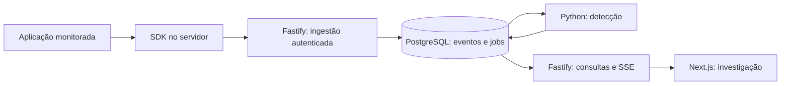

# Sentinel

[](https://github.com/samuelsce/Sentinel/actions/workflows/ci.yml)

Central de monitoramento de segurança para aplicações web. Projeto de portfólio que conecta **Fullstack, AppSec e Blue Team**, com integração real, detecções explicáveis e evidências reproduzíveis.

O objetivo é ajudar uma equipe a responder: o que aconteceu, em qual aplicação, por que merece investigação e quais eventos sustentam o alerta.

**Status: M2 — identidade, escopo e credenciais implementados.** Já é possível iniciar os serviços, autenticar pela API, administrar projetos/membros e emitir/revogar chaves. Ingestão, SDK e detecção serão entregues nos próximos marcos; ainda não há monitoramento funcional nem UI de login. [Roadmap completo](docs/ROADMAP.md).

## O que já pode ser avaliado

- Monorepo TypeScript e worker Python com dependências travadas em lockfiles.
- Ambiente Docker Compose com PostgreSQL, migrations, API, worker privado e frontend mínimo.
- Contrato de eventos v1: uma fonte Zod gera JSON Schema para TypeScript e Python.
- 25 cenários de contrato compartilhados, incluindo tentativa de alterar escopo, metadata com senha, IP/data inválidos e combinações incoerentes de tipo/action/outcome.
- Modelo de dados com relações compostas para organização/projeto/chave/ambiente e unicidade de eventos/jobs.
- Testes em PostgreSQL real, permissões distintas para API/worker e tratamento de erros sem imprimir credenciais.
- CI que verifica código, build, contratos, migrations e inicialização dos serviços.
- Login/logout, sessões revogáveis, expiração por inatividade/absoluta, cookies seguros e proteção CSRF.
- Administração de projetos/membros/chaves com três papéis, escopo obrigatório e auditoria transacional.
- 20 cenários de identidade em PostgreSQL real, incluindo IDs externos, revogação, rotação, rate limiting e concorrência do último administrador.

Os relatórios da [M1](docs/milestones/M1.md) e [M2](docs/milestones/M2.md) registram evidências e limitações. A [documentação de identidade](docs/AUTHENTICATION.md) explica sessões, permissões e endpoints; o [contrato](docs/CONTRACTS.md) define o formato de integração.

## Executar o ambiente completo

Pré-requisitos: Git, Node.js **24.20.0**, Docker Engine/Desktop ativo com suporte a containers Linux e Docker Compose v2. As dependências Node/Python são instaladas dentro das imagens; Python e pnpm locais não são necessários para este caminho.

```sh
git clone https://github.com/samuelsce/Sentinel.git
cd Sentinel
node scripts/setup.mjs
docker compose up --build -d --wait --wait-timeout 120
```

O setup gera `.env` com credenciais locais aleatórias e preserva um arquivo existente. A configuração de referência está em [.env.example](.env.example); nenhum segredo real é versionado.

Abra [localhost:3000](http://localhost:3000): a tela deve exibir **Ambiente conectado**, após consultar a API e o banco. Os endpoints [liveness](http://localhost:3001/health/live) e [readiness](http://localhost:3001/health/ready) retornam `ok` e `ready`. O serviço `migrate` termina com código 0; os demais ficam saudáveis. O worker da M1 verifica o contrato/banco e aguarda: ele ainda não consome jobs.

```sh
docker compose ps -a
docker compose logs --tail=50 api detector web
docker compose down
```

`down` para os serviços e preserva os dados. Ao alterar código, execute novamente o comando com `--build`. Portas publicadas ficam restritas a `127.0.0.1`: frontend 3000, API 3001 e PostgreSQL 55432. Worker não publica porta. Este ambiente é de desenvolvimento local.

## Avaliar a identidade da M2

O primeiro administrador é criado por comando local, sem senha padrão:

```sh
docker compose run --rm -it migrate pnpm admin:provision
```

Informe email, deixe o UUID da organização vazio, informe nome e senha. A senha fica oculta e não é aceita em argumentos. O comando devolve somente IDs/papel. Repita com uma organização existente para criar outro membro e escolher seu papel. `-- --link` vincula um usuário existente sem mudar sua senha.

O acesso é pela API nesta etapa; a tela de login será construída junto ao dashboard. Consulte [AUTHENTICATION.md](docs/AUTHENTICATION.md) para testar login, enviar cookie/CSRF, criar projeto e gerar/revogar chave. `APP_ORIGIN` permite uma origem exata, por padrão `http://localhost:3000`; HTTP só é aceito no ambiente local.

Para avaliar os controles sem criar contas pessoais, execute `pnpm test:identity` após instalar as dependências locais. O teste usa `sentinel_test`, cria duas organizações e três papéis com credenciais aleatórias, verifica 20 cenários e remove suas fixtures. Não altera usuários do banco principal. A CI repete essa avaliação no PR.

## Desenvolver e verificar localmente

Além do Docker: pnpm **11.25.0** e uv **0.12.23**. A versão sugerida do Node está em `.node-version`; a faixa aceita é Node 24 a partir de 24.19.0. Python **3.12.14** é indicado em `services/detector/.python-version` e pode ser gerenciado pelo uv.

```sh
pnpm install --frozen-lockfile
pnpm env:init
docker compose up -d --wait postgres
pnpm db:migrate
pnpm dev
```

Este modo executa API e frontend com recarga local. Não o execute nas mesmas portas de um Compose completo já iniciado. Para o worker, em outro terminal:

```sh
cd services/detector
uv sync --locked --python 3.12.14
uv run --env-file ../../.env --no-sync sentinel-detector
```

Verificação TypeScript, schemas e banco, na raiz:

```sh
pnpm check
pnpm build
pnpm test:database
pnpm test:identity
pnpm test:smoke
```

`test:database` aplica as migrations duas vezes no banco dedicado `sentinel_test` e executa cenários de integridade dentro de uma transação revertida ao final. `test:smoke` precisa de API/frontend ativos; ele confirma endpoints e o estado real exibido pela página.

Verificação Python, em `services/detector`:

```sh
uv run --no-sync ruff check .
uv run --no-sync ruff format --check .
uv run --no-sync pytest -q
```

Mudar contrato: `pnpm contracts:generate` e executar os testes nos dois runtimes. Mudar banco: `pnpm db:generate`, revisar o SQL gerado e executar `pnpm db:migrate`. Detalhes em [DEVELOPMENT.md](docs/DEVELOPMENT.md).

## Stack e responsabilidades

| Área | Versões atuais | Responsabilidade implementada |
| --- | --- | --- |
| Frontend | Next.js 16.4.0, React 19.3.0, TypeScript 5.9.3 | Tela inicial com conexão real e estados de erro |
| API | Node.js 24.20.0, Fastify 5.12.5, Argon2 2.2.2, cookies 11.1.2 | Sessões, CSRF, papéis, projetos, chaves, auditoria e health checks |
| Contratos | Zod 4.6.5, JSON Schema 2020-12 | Validação portátil, allowlists e exemplos compartilhados |
| Banco | PostgreSQL 18.6, Drizzle ORM 0.45.3 / Kit 0.31.11 | Integridade de escopo, sessões, limites persistentes, auditoria e eventos/jobs |
| Worker | Python 3.12.14, psycopg 3.3.6, jsonschema 4.26.0 | Readiness e leitura do contrato gerado |
| Qualidade | Biome, Vitest, pytest, Ruff, GitHub Actions | Checks, testes e build reproduzível |

As imagens base são fixadas por digest. Os arquivos `pnpm-lock.yaml` e `services/detector/uv.lock` registram dependências transitivas.

Tailwind, shadcn/ui e TanStack Query entram com os fluxos do dashboard na M5. Playwright será usado na validação dos fluxos completos. Semgrep e análise de dependências fazem parte da evolução da CI de segurança. Redis e FastAPI dependem de necessidade medida; não são serviços obrigatórios da M1.

## Arquitetura do produto planejado



O evento e o job serão persistidos na mesma transação. Processamento pelo menos uma vez exige resultados idempotentes; o dashboard recuperará mudanças pela API após desconexões. A M1 entrega a base desses componentes, sem expor ingestão não autenticada.

## Próximas entregas

| Marco | Resultado |
| --- | --- |
| M2 | Concluída nesta entrega: sessões revogáveis, papéis, projetos e chaves restritas |
| M3 | Ingestão autenticada, SDK e aplicação de exemplo instrumentada |
| M4 | Três detecções: falhas repetidas de login, acessos negados e ações administrativas suspeitas |
| M5 | Dashboard, eventos, alertas, evidências e investigação |
| M6 / v0.1.0 | Validação de segurança, métricas, retenção e demonstração reproduzível |
| M7 / v0.2.0 | Resposta manual com bloqueio temporário e relatório sanitizado |

O walkthrough final mostrará atividade normal e suspeita em uma aplicação própria com dados fictícios. Cada alerta apresentará regra/versão, janela, contagem e evidências. Cenários benignos e falsos positivos também serão documentados.

## Documentação para avaliar o projeto

- [Produto e escopo](docs/PRODUCT.md)
- [Arquitetura e decisões](docs/ARCHITECTURE.md)
- [Contrato de eventos](docs/CONTRACTS.md)
- [Identidade, permissões e credenciais](docs/AUTHENTICATION.md)
- [Ambiente, versões e desenvolvimento](docs/DEVELOPMENT.md)
- [Modelo de ameaças e controles planejados](docs/SECURITY.md)
- [Critérios de validação](docs/VALIDATION.md)
- [Roadmap](docs/ROADMAP.md), relatórios da [M1](docs/milestones/M1.md)/[M2](docs/milestones/M2.md) e [changelog](CHANGELOG.md)
- [Referências visuais e adaptação](docs/DESIGN.md)

Cada entrega atualiza esta documentação, usa uma branch separada e mantém commits por responsabilidade. Mudanças chegam à `main` por pull request com checks; não há merge automático. Funcionalidades planejadas não são apresentadas como prontas.
