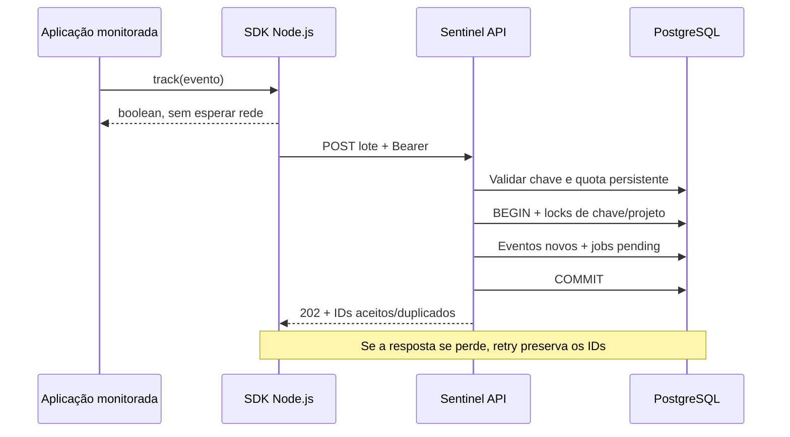

# Ingestão, SDK de servidor e laboratório — M3

A aplicação monitorada já pode emitir eventos pelo SDK TypeScript; a API valida a credencial e persiste eventos e jobs no PostgreSQL. O worker da [M4](DETECTIONS.md) consome a fila. Um `202` confirma persistência, sem prometer alerta ou conclusão do job.

## Fluxo implementado



## Endpoint e credencial

`POST /v1/ingest/events`, JSON `{ "events": [...] }`, cabeçalho `Authorization: Bearer <chave de ingestão>`. A chave é emitida/revogada pelo fluxo da [M2](AUTHENTICATION.md) e identifica organização, projeto e ambiente. Cookie de usuário não autentica ingestão. Essa rota de máquina não depende de Origin/CSRF; não há CORS para expor a chave em aplicações de navegador.

Organização/projeto/chave/recebimento são acrescentados no servidor. Payload com campos de escopo é rejeitado, e o ambiente deve corresponder à credencial. O papel declarado no evento descreve a aplicação monitorada e não concede permissões no Sentinel. `source_ip` é informado pelo servidor monitorado, validado estruturalmente e tratado como dado do emissor; a API não persiste o IP da conexão SDK nesta etapa.

O recibo contém IDs únicos de cada lote:

```json
{
  "accepted": ["3737d031-515c-4d76-a7cb-66bb1c0b0e1e"],
  "duplicates": []
}
```

Não copie este ID/timestamp fixo em tráfego real: o SDK gera ambos. Respostas não devolvem evento, segredo ou mensagem do banco. `Cache-Control: no-store` aplica-se às rotas de negócio.

| Resultado | HTTP | Efeito |
| --- | --- | --- |
| Lote aceito, incluindo replay idêntico | 202 | Eventos/jobs confirmados; IDs separados no recibo |
| Chave ausente, inválida ou revogada | 401 | Sem gravação; autenticação precede leitura do body |
| Contrato, ambiente, lote ou janela inválidos | 400 | Lote rejeitado integralmente |
| ID existente com conteúdo diferente | 409 | Lote rejeitado integralmente |
| Body maior que 256 KiB ou evento normalizado maior que 8 KiB | 413 | Sem aceite |
| Quota de projeto excedida | 429 + Retry-After | Sem novos eventos/jobs |
| Capacidade/backlog excedidos | 503 + Retry-After | Sem novos eventos/jobs |
| Banco ou operação interna falhou | 500 genérico | Sem confirmação; SDK pode reenviar |

## Deduplicação e atomicidade

Unicidade é `(project_id, event_id)`: duas organizações/projetos podem usar o mesmo UUID sem interferência. Replay idêntico por outra chave do mesmo projeto/ambiente retorna duplicado, mantendo a chave e `received_at` originais. Igualdade usa JSONB, sem depender da ordem de propriedades. O mesmo ID com conteúdo diferente causa `409`, inclusive dentro do próprio lote. Repetições idênticas dentro do lote aparecem uma vez no recibo.

Eventos novos aceitam até 24 horas no passado e 2 minutos no futuro. Replay de evento já persistido compara conteúdo e continua aceito depois dessa janela, pois não introduz nova ocorrência. Eventos/jobs são inseridos na mesma transação; um erro ao inserir qualquer job reverte o lote inteiro. O recibo só é enviado após o commit.

A transação mantém `FOR SHARE` na chave e `FOR UPDATE` no projeto. Se a ingestão obtiver o lock da chave antes da revogação, ela pode concluir; a revogação espera e impede requests seguintes. Se a revogação obtiver o lock primeiro, a ingestão revalida a chave e falha. O lock de projeto serializa a deduplicação e o teste de backlog entre processos/chaves. Há restrições únicas/FKs no banco como segunda camada de integridade.

## Limites da API

| Limite | Valor da M3 |
| --- | --- |
| Eventos por lote | 1–100 |
| Body | 256 KiB, bytes de transporte |
| Evento normalizado | 8 KiB, bytes UTF-8 |
| Requests autenticadas por projeto | 60/minuto, janela fixa UTC |
| Eventos apresentados em lotes aceitos | 3.000/minuto por projeto, incluindo duplicados |
| Jobs pending/processing por projeto | 10.000; novos eventos bloqueados no limite |
| Requests de ingestão simultâneas | 8 por processo; excesso recebe 503/Retry-After 1 |

Quotas ficam em `ingestion_quotas`, uma linha por projeto, compartilhadas entre chaves e processos. Rotação não reinicia os contadores. Requests autenticadas são contabilizadas antes da validação, inclusive lotes inválidos. O contador de eventos integra a transação e só avança no aceite. Contadores não regressam se uma request de janela antiga terminar depois de uma nova. Relógios dos processos devem estar sincronizados na operação com réplicas.

Backlog cheio permite replay idêntico sob as quotas normais. O teto protege a fila, mas não substitui retenção: eventos históricos e jobs finalizados ainda precisam da M6. O worker atual não consome a fila; repetidas execuções da demo acumulam jobs. Valores são parâmetros iniciais de laboratório, sem benchmark de throughput/p95 nesta entrega.

## SDK Node.js

O pacote privado `@sentinel/sdk` exporta fontes TypeScript dentro do monorepo. Não foi publicado no npm. Executar com Node 24/tsx ou integrar ao build do servidor. Importa APIs `node:*` e deve permanecer exclusivamente no servidor, fora de componentes/client bundles e variáveis `NEXT_PUBLIC_*`.

```ts
import { SentinelClient } from "@sentinel/sdk";

const sentinel = new SentinelClient({
  endpoint: "http://127.0.0.1:3001/v1/ingest/events",
  ingestionKey: process.env.SENTINEL_INGEST_KEY!,
  environment: "development", // deve corresponder à chave
});

// Após a decisão real de login/autorização, sem await no caminho do usuário:
const buffered = sentinel.track({
  type: "auth.login_failed",
  action: "log_in",
  outcome: "failure",
  actor_id: "user-opaque-id",
  resource: "/login",
  metadata: { reason: "invalid_credentials" },
});

console.log({ buffered, metrics: sentinel.stats() });
// No encerramento do serviço:
await sentinel.close(5000);
```

`track` valida/copia o evento, gera UUID/data/versão/ambiente e retorna `false` em contrato inválido, buffer cheio ou encerramento. Não realiza I/O nem lança erro de rede. Configuração inválida do construtor causa erro de startup. Não incluir email, senha, cookie, chave, body original ou query sensível; o contrato usa allowlists, mas não detecta informação sigilosa escondida num campo permitido.

| Opção | Padrão |
| --- | --- |
| `maxBufferedEvents` / `maxBufferedBytes` | 500 / 2 MiB de eventos serializados |
| `batchSize` | 50, respeitando também os 256 KiB do body |
| `flushIntervalMs` | 1.000; `0` desativa envio automático |
| `timeoutMs` | 2.000 por tentativa, incluindo leitura do recibo |
| `maxAttempts` | 3, limite configurável até 5 |
| `maxAgeMs` | 60.000, checado antes de enviar/repetir |
| `close(deadlineMs)` | 5.000; limite até 30.000 |

Itens em envio continuam consumindo o limite do buffer. Overflow descarta o evento novo e preserva o lote atual. Um `flush` por vez processa um snapshot da fila; chamadas concorrentes compartilham a mesma Promise. `close` impede novos eventos, cancela o timer, tenta flush e aborta envio/espera quando vence o prazo.

Retries preservam exatamente o body/IDs. Rede/timeout, recibo inválido e HTTP 408/429/500/502/503/504 recebem retries com backoff exponencial e jitter; `Retry-After` em segundos/data é considerado até 60 s. Outros status encerram o lote. Ao esgotar tentativas, o SDK descarta e contabiliza a perda. HTTPS é obrigatório fora de loopback; URLs com usuário/senha/query/fragmento são rejeitadas e redirects não são seguidos. O recibo é limitado a 64 KiB e precisa confirmar todos os IDs únicos, sem IDs extras/repetidos.

`stats()` devolve somente contadores e estado do buffer: `enqueued`, `accepted`, `duplicates`, `invalid`, `overflow`, `terminal`, `exhausted`, `expired`, `closed`, `retries`, `failures`, `timeouts`, `bufferedEvents`, `bufferedBytes`, `flushing`. Accepted/duplicates contam IDs confirmados pelo servidor; perdas contam itens. IDs repetidos deliberadamente no mesmo lote podem resultar em menos IDs confirmados que itens enfileirados. Esses números não contêm chaves nem payloads.

O buffer é volátil: crash antes do aceite pode perder eventos. Perda de resposta após commit pode produzir `exhausted` local mesmo com evento persistido; esse contador representa falta de confirmação, não prova de ausência no banco. Durabilidade começa no commit da API. Spool em disco e publicação do SDK ficam para evolução.

## Demo local reproduzível

Com Compose ativo e dependências locais instaladas conforme README:

```sh
pnpm demo:setup
pnpm demo:start
```

Em outro terminal:

```sh
pnpm demo:scenario
```

O setup usa exclusivamente `DATABASE_URL` no banco local `sentinel`, cria organização/projeto isolados, operador fictício e chave `demo`, e grava `.env.demo` ignorado pelo Git/Docker. As senhas e chave são aleatórias e não são impressas. Uma execução posterior preserva o arquivo e não emite nova chave. As variáveis estão descritas em [apps/demo/.env.example](../apps/demo/.env.example); o arquivo gerado já contém valores funcionais. Banco/volume e configuração devem ser preservados juntos, como no ambiente principal.

O servidor da demo escuta somente `127.0.0.1:3002`, não acessa o banco e tem contas fictícias `reader`/`admin` com senhas distintas do operador Sentinel. Mantém sessões em memória, senha Argon2id, cookie HttpOnly/SameSite Strict, Origin/CSRF para alterações, quota de 60 POST/minuto e duas verificações de senha simultâneas. Não existe endpoint que aceite um evento arbitrário para simular ataque.

| Rota da demo | Comportamento |
| --- | --- |
| `GET /health/live` | Processo disponível |
| `POST /login` | JSON username/password; decisão real e evento de sucesso/falha |
| `POST /admin/settings` | Cookie + Origin + CSRF; reader recebe 403/evento, admin altera um boolean e emite ação |
| `GET /lab/metrics` | Snapshot sanitizado do SDK, apenas na demo local |

`demo:scenario` lê as senhas do arquivo local e produz 9 falhas de login (6 reader, 3 admin), 2 logins válidos, 10 acessos negados e 1 ação administrativa: **22 eventos**. Imprime somente contagens/status. Aguarde o intervalo de envio e abra [métricas locais](http://localhost:3002/lab/metrics): `accepted + duplicates` deve crescer 22 sem perdas, se API/chave estiverem disponíveis. Execuções novas criam novos IDs; reenvio do SDK usa os IDs originais. A M4 verifica as três detecções em projeto novo: [regras, consultas e limitações](DETECTIONS.md). O script do cenário confirma as ações da demo; consulte a API para confirmar os alertas persistidos.

Para avaliar indisponibilidade sem alterar os serviços principais, `pnpm test` inclui uma demo conectada a transporte indisponível. O login/admin permanecem funcionais e `exhausted` registra 22 eventos sem confirmação. `pnpm test:ingestion` cria fixtures no `sentinel_test`, usa o papel real da API e percorre demo → SDK → HTTP → banco/jobs, incluindo resposta perdida. `pnpm test:detection` acrescenta worker e investigação. Remove suas fixtures e não altera contas do banco principal.

## Referências técnicas consultadas

- [PostgreSQL — locks explícitos](https://www.postgresql.org/docs/current/explicit-locking.html): compatibilidade dos locks de chave/projeto e serialização da revogação.
- [PostgreSQL — INSERT/ON CONFLICT](https://www.postgresql.org/docs/current/sql-insert.html): atualização atômica de quota persistente.
- [Node.js — AbortSignal](https://nodejs.org/api/globals.html#class-abortsignal): timeout e cancelamento de fetch, verificados no Node 24 desta entrega.
- [Fastify — configuração do servidor](https://fastify.dev/docs/latest/Reference/Server/): limites de body/timeout e execução dos hooks.

Os limites, política de replay e descarte são decisões do Sentinel, verificadas nos testes desta entrega.
