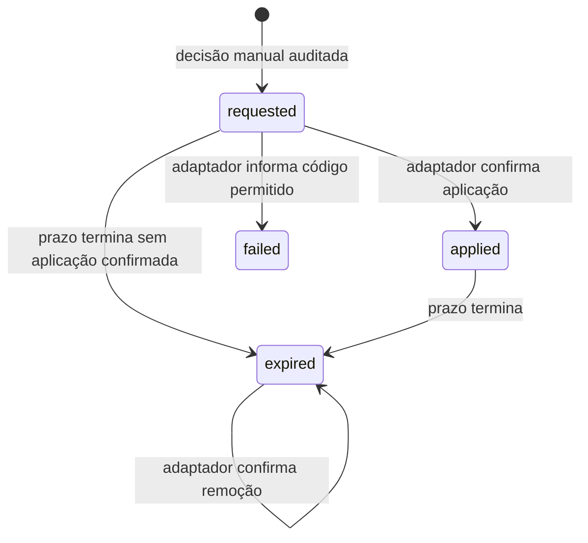

# Resposta temporária, regras e relatórios — M7

O Sentinel registra a decisão humana; a aplicação integrada executa e confirma o bloqueio. A implementação fornecida protege **somente a demo HTTP local**, em um processo. Não altera firewall, proxy, rede, dashboard ou outra aplicação.

## Reproduzir a entrega

```sh
docker compose up --build -d --wait --wait-timeout 120
pnpm demo:setup
pnpm demo:start
```

Em outro terminal, execute `pnpm demo:scenario`. Uma configuração nova da demo contém a chave de ingestão e uma **credencial de resposta independente**, ambas aleatórias e somente no servidor. Entre no dashboard com a conta administrativa fictícia criada em `.env.demo`, selecione o projeto da demo e abra o alerta AUTH-001. Consulte a timeline, selecione o IP de uma evidência, informe um motivo sem segredos e escolha 15 segundos. **Revisar bloqueio → Solicitar bloqueio** registra a intenção. Aguarde a confirmação `Aplicado`.

No laboratório, o IP observado é `127.0.0.1`: durante o bloqueio, [métricas da demo](http://127.0.0.1:3002/lab/metrics) retornam 403. O Sentinel continua acessível em [localhost:3000](http://localhost:3000). Após o TTL, a demo volta a aceitar o IP e confirma a remoção. `/health/live` permanece disponível para verificar o processo. A demo não confia em `X-Forwarded-For`; não use headers para simular um IP de cliente.

**Configuração anterior à M7:** `demo:setup` preserva `.env.demo` e não substitui credenciais existentes. No dashboard, abra **Integração → Adaptador de resposta**, crie uma credencial para `demo` e copie-a uma única vez para `DEMO_RESPONSE_KEY` no arquivo local. Acrescente `DEMO_RESPONSE_ENDPOINT=http://127.0.0.1:3001/v1/response` e reinicie `demo:start`. Se já houver uma credencial ativa cujo segredo não foi guardado, revogue-a antes de emitir outra. Não coloque valores reais em commits, capturas, comandos compartilhados ou documentação.

## Protocolo e estados

Base `B = /v1/organizations/:orgId/projects/:projectId`.

| Rota | Credencial / papel | Comportamento |
| --- | --- | --- |
| `GET B/response-keys` | Sessão admin | Metadados, nunca hash ou segredo |
| `POST B/response-keys` | Sessão admin + Origin/CSRF | `{environment}`; segredo exibido uma vez |
| `DELETE B/response-keys/:keyId` | Sessão admin + Origin/CSRF | Revoga futuras consultas/confirmações |
| `GET B/alerts/:alertId/responses` | Sessão de membro ativo | Últimas 100 ações, prazos e resultados |
| `POST B/alerts/:alertId/responses` | Sessão admin/analyst + Origin/CSRF | `{requestId,sourceIp,reason,ttlSeconds}`; 202 significa solicitado |
| `GET /v1/response/commands` | Bearer `snt_rsp_…` | Escopo vem da credencial; sem motivo ou identidade do operador |
| `POST /v1/response/commands/:actionId/ack` | Bearer de resposta do mesmo projeto/ambiente | `{state:"applied"}`, `{state:"failed",failureCode}` ou `{state:"expired"}` |

Chaves `snt_ing_…` e cookies de usuário não executam o protocolo. A credencial de resposta também não ingere eventos. Existe uma credencial ativa por projeto/ambiente; a demo aceita somente comandos de `demo`.

O papel do banco da API pode atualizar somente resultado/confirmacões de uma ação; alvo, motivo, autor e TTL não recebem UPDATE. O detector não acessa credenciais ou ações de resposta. A auditoria registra a credencial que confirmou cada aplicação/falha/remoção, sem o seu segredo.



- TTL de **15 a 3600 segundos**, contado desde a solicitação e armazenado como prazo absoluto. Entrega repetida, reinício e confirmação não o estendem.
- O alvo precisa corresponder a um IP nas evidências preservadas do alerta. A API normaliza IPv4/IPv6; o operador escolhe um endereço da página de evidências exibida.
- `requestId` é UUID gerado pelo cliente. Uma repetição do mesmo operador e intenção retorna a ação existente; alterar seu conteúdo retorna 409. A ação é registrada na mesma transação que a auditoria.
- Até **100 bloqueios ativos por projeto**. Consulta de comandos devolve até 200 itens, priorizando todos os ativos antes das expirações pendentes; o backlog de expirações não omite bloqueios durante restauração.
- O adaptador consulta a cada 2 segundos, instala o bloqueio antes de confirmar e repete confirmações sem duplicar auditoria. Códigos de falha aceitos: `capacity`, `unsupported_target`, `adapter_error`; sem mensagens livres ou stack traces.
- Prazo encerrado é distinto de remoção confirmada: `expiredConfirmedAt` permanece vazio até o adaptador confirmar. Uma aplicação tardia de ação expirada retorna 409.
- A tabela local mantém ações por ID. Dois bloqueios do mesmo IP são independentes: expirar o primeiro não remove o segundo. A expiração local funciona mesmo com o Sentinel indisponível.
- O processo restaura comandos antes de abrir a porta HTTP. Com adaptador configurado e API indisponível no início, a demo não inicia. Durante a execução, mantém bloqueios conhecidos até seus prazos. Sem configuração de resposta, a demo anterior continua funcionando apenas com ingestão.

Use relógios sincronizados. A confirmação é uma declaração autenticada de uma aplicação confiável; não é atestação de firewall. A demo tem uma tabela em memória e restauração pela API, não spool durável nem coordenação de réplicas. Uma credencial não impede sua cópia para outro processo: não execute várias instâncias com ela esperando confirmação individual. Esses adaptadores e controles distribuídos são evoluções.

## Configuração versionada

**Regras** mostra três configurações atuais e as últimas 50 alterações do projeto. Admin altera ativação, limite de 2 a 100 eventos e janela de 30 a 3600 segundos; analistas/leitores consultam. Título, severidade, código e ações críticas não são campos editáveis. Em ADMIN-001, mudança de privilégio continua gerando alerta quando a regra está ativa; limite/janela se aplicam à ação crítica após falhas.

`GET B/rule-settings` retorna `{current,history}`. `PATCH B/rule-settings/:code` exige `{expectedVersion,enabled,threshold,windowSeconds}`, Origin e CSRF. Edição obsoleta retorna 409; uma alteração idêntica não cria versão. As definições e revisões são append-only para os papéis de execução. A sequência global aloca versões únicas, que podem ter intervalos: v1 é a definição original, não há contagem de versões consecutivas por projeto.

O trigger `job_rule_snapshot` captura código, versão e ativação **na transação de ingestão**. Configuração e ingestão serializam no lock do projeto. O detector busca as definições imutáveis daquela seleção, incluindo depois de reiniciar; jobs anteriores à migration, sem snapshot, usam a versão original. Alterar configuração não reinterpreta jobs já recebidos ou decisões existentes. Cada versão abre seus próprios episódios. Eventos futuros podem considerar eventos anteriores na sua nova janela, inclusive recebidos quando a regra estava desativada; não há reprocessamento retroativo.

No cenário de validação, um burst benigno de cinco falhas produz sinal no padrão de cinco. Subir o limite para oito elimina esse sinal para um novo IP, e os três eventos seguintes atingem exatamente o novo limite. Isso demonstra um ajuste reproduzível; **não mede taxa de falsos positivos de produção**. Aumentar limites pode deixar ataques sem sinal. Evidência quantitativa e risco precisam orientar alterações reais.

## Exportação sanitizada

**Baixar relatório sanitizado** consulta `GET B/alerts/:alertId/report` e baixa `sentinel-investigation.json`. Membros ativos podem exportar, inclusive leitores; a exportação é auditada. Não há arquivo público ou URL de compartilhamento no servidor.

O formato `sentinel.investigation.v1` constrói uma projeção permitida: código/versão/limite/janela, estado, severidade, decisões inicial/final, até 200 evidências e contagens de resposta. IPs, atores e eventos viram rótulos locais (`ip-1`, `actor-1`, `event-1`); relacionamentos dentro do relatório permanecem. Não exporta IDs de organização/projeto/usuário, emails, recursos, request IDs, metadata, credenciais, motivo de bloqueio ou payload bruto. Horários e ambiente são mantidos; pseudonimização não garante anonimato. Revise o arquivo e cuide de sua retenção depois de baixá-lo.

O relatório usa snapshots e continua funcionando após a retenção dos eventos originais, sinalizando `rawAvailable:false`. `evidenceTruncated` informa o limite do episódio. A retenção privada remove respostas encerradas junto de alertas resolvidos elegíveis após 90 dias; preserva alertas com resposta ainda dentro do prazo. Não remove downloads externos.

## Verificação

```sh
pnpm test:response
pnpm --filter @sentinel/web build
pnpm test:web
```

Usam o banco isolado `sentinel_test`, credenciais fictícias e papéis reais. Execute suites de banco serialmente. Resultados e evidências em [M7.md](milestones/M7.md); visual adaptado das referências registradas em [DESIGN.md](DESIGN.md).
