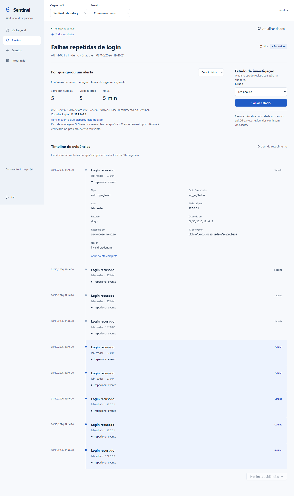
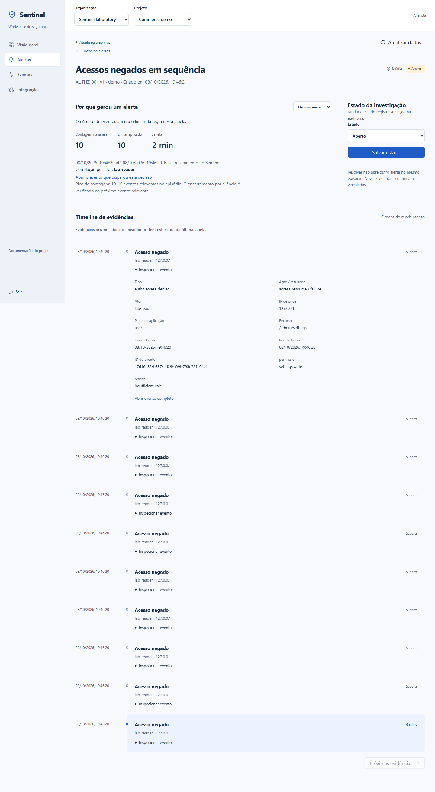
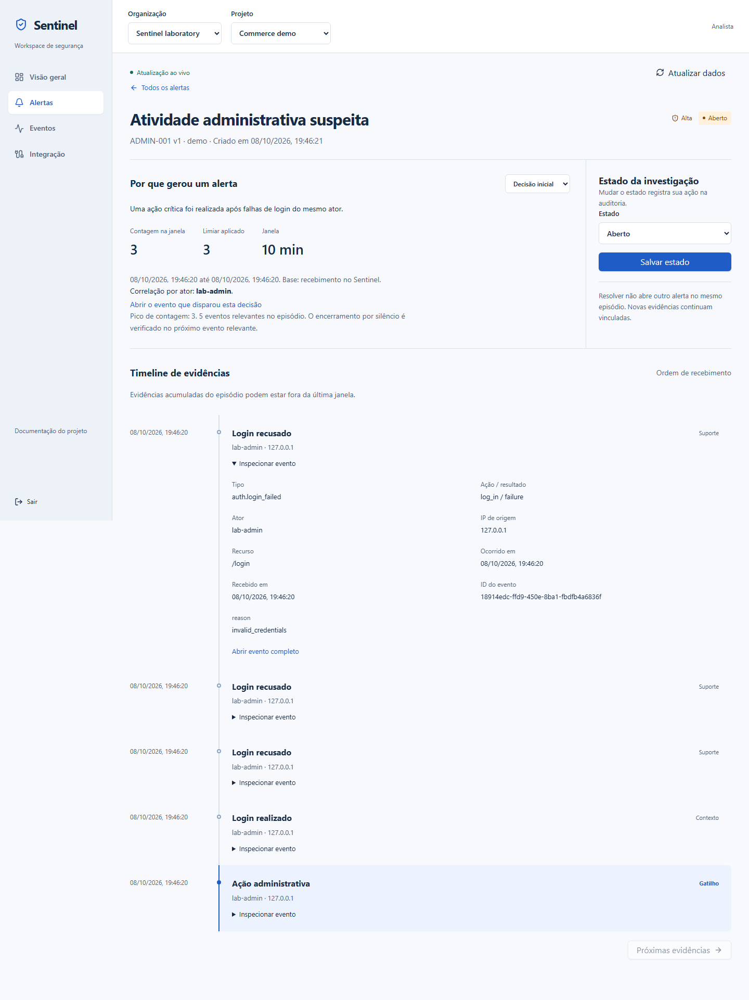
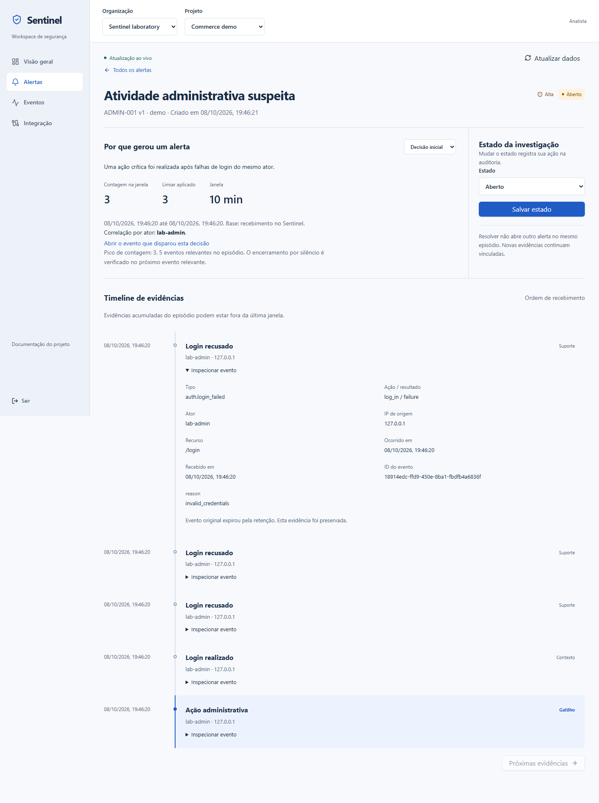

# Demonstração reproduzível para avaliação

O Sentinel conecta uma aplicação instrumentada, SDK Node.js, API Fastify, PostgreSQL, worker Python e dashboard Next.js. Os dados são fictícios; requests de login/autorização são reais. Não existe botão público de simulação nem envio de credenciais de ingestão pelo browser.

## Preparar

Siga o setup Docker do [README](../README.md). Com pnpm 11.25.0/Node 24.20.0:

```sh
pnpm install --frozen-lockfile
pnpm demo:setup
pnpm demo:start
```

Em outro terminal, execute `pnpm demo:scenario`. O setup guarda credenciais aleatórias em `.env.demo`, ignorado pelo Git, e provisiona o operador Sentinel. Consulte localmente `DEMO_OPERATOR_EMAIL`/`DEMO_OPERATOR_PASSWORD` para entrar em `http://localhost:3000/login`. Não copie o arquivo para issues, screenshots ou PRs. Selecione a organização/projeto criados e ambiente demo. Aguarde a fila terminar e abra Alertas.

Em projeto novo, espere **22 eventos e três alertas**. Repetir dentro das janelas atualiza os episódios, portanto contagens aumentam sem representar duplicação do mesmo ID. `pnpm test:web` cria projeto/usuários descartáveis em `sentinel_test`, instrumenta a demo, processa o worker real e testa as telas com Chromium. Os screenshots publicados vêm desse fluxo, com a conta temporária ocultada.

## Três cenários observados

| Regra v1 | Entradas pela demo | Resultado em projeto novo | Evidência |
| --- | --- | --- | --- |
| AUTH-001 | 6 logins falhos do reader e depois 3 do admin pelo mesmo IP | High: limiar inicial 5, janela 300 s, pico 9 | Correlação por IP; primeira/última decisão distintas; falhas na timeline |
| AUTHZ-001 | Reader autenticado tenta `/admin/settings` dez vezes e recebe 403 | Medium: 10 negações em 120 s | Ator `lab-reader`, recurso/papel/permission e suporte/gatilho |
| ADMIN-001 | 3 logins falhos do admin, login bem-sucedido e mudança real de settings | High: ação crítica após 3 falhas em 600 s | Ator `lab-admin`; falhas como suporte, sucesso como contexto, ação como gatilho |







Compare Decisão inicial/Última decisão, contagem, limiar, intervalo e correlação. São no máximo 200 evidências por episódio, com truncamento sinalizado. As regras usam recebimento no Sentinel, não o relógio do cliente. Reader consulta; analyst/admin triam/resolvem. Mudanças criam auditoria e exigem a versão atual; conflito pede nova leitura.

## Benignos e limites

`pnpm test:detection` reproduz fronteiras: quatro falhas não cruzam AUTH-001; nove negações não cruzam AUTHZ-001; atividade administrativa não crítica ou abaixo de três falhas não dispara aquela condição. Os dois logins bem-sucedidos do cenário são contexto, sem virar falhas. Mudança de privilégio bem-sucedida tem caminho próprio em ADMIN-001.

Senha esquecida e NAT compartilhado podem cruzar AUTH-001; permissões incorretas podem cruzar AUTHZ-001; manutenção autorizada após erros de senha pode cruzar ADMIN-001. Alertas indicam investigação, sem concluir automaticamente que houve ataque. Carga benigna não representa todos os custos de eventos hostis; regras permanecem fixas/versionadas nesta versão.

## Expiração e recuperação

`pnpm test:operations` envelhece fixtures, compara dry-run/apply e confirma paginação de snapshots. O último fluxo de `pnpm test:web` drena jobs, envelhece eventos por 31 dias e executa purge privado somente no projeto descartável. As investigações continuam acessíveis; links para originais expirados desaparecem.



`pnpm lab:benchmark` mede carga e reinício do worker; leva pelo menos dez minutos. [Operação](OPERATIONS.md) explica os relatórios. Queda/reconexão da UI, sessão revogada, reader sem permissão, erro de API, teclado/mobile são exercitados em `pnpm test:web`/`pnpm test:live`. [Validação M6](milestones/M6.md) separa medidas de metas não medidas.
